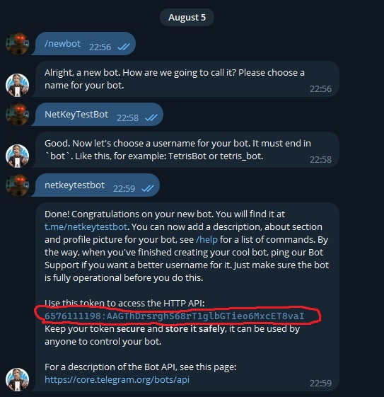
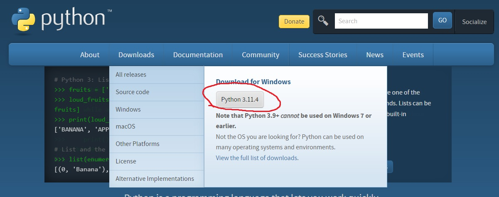
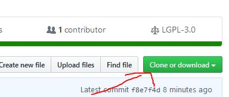
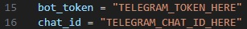
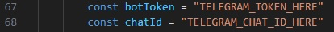

# VisionGram
🌎 VisionGram is a web-based application that lets you send a photo from your webcam, a voice message from your microphone, or your location from your GPS, VisionGram can do it all with just one click. VisionGram is easy to use, fast and secure. You can access it from any device with a browser and an internet connection.

  

  
    

### LEGAL DISCLAIMER PLEASE READ!
##### I, the creator and all those associated with the development and production of this program are not responsible for any actions and or damages caused by this software. You bear the full responsibility of your actions and acknowledge that this software was created for educational purposes only. This software's intended purpose is NOT to be used maliciously, or on any system that you do not have own or have explicit permission to operate and use this program on. By using this software, you automatically agree to the above.

## License

This project is licensed under the MIT License - see the [LICENSE](/LICENSE) file for details

# :hammer: Compiling guide:  
* Go to the [@BotFather](https://t.me/BotFather) bot and create your own bot. You need to save the token and bot name.  
    
* Now you need to get your chat id. To do this, go to the next bot [@chatid_echo_bot](https://t.me/chatid_echo_bot) and save the id.  
    
* Now you need to download [Python](https://www.python.org/)  
    
* Download the [source code](https://github.com/cisamu123/NetKey/archive/refs/heads/main.zip) of this program.  
  
* Unzip the project folder to your desktop.
* Install requirements
Open your command prompt (CMD) or terminal.
Navigate to the directory where your requirements.txt file is located using the cd command. For example:
cd C:\Users\User\Downloads\VisionGram\requirements.txt
Run the following command to install the dependencies:
pip install -r requirements.txt
* Open the app.py file through IDE or notepad.  
* Change the value of TOKEN and CHAT_ID in NetKey.py
* Open the templates/index.html file through IDE or notepad.  
* Change the value of TOKEN and CHAT_ID in index.html
* Python Code Line Config
  
* Html Code Line Config
   
* Insert your token from the bot and your chatID that you received earlier.  
* Press CTRL + S to save and start the file called app.py to run web panel.
* You can host localhost using ngrok and send the received url to someone.  
* After clicking button on web page, data will be sent to your Telegram account from the bot.

# :moneybag: Donate:
**BTC:** `bc1q5exw2v9sa0yktp2t7xnq8ma2xpn5a29s7w283y`  
**ETH:** `0x8d797249170d263B959A3c688D8456adBcfBC319`  
**XMR:** `0xF978FE35d00A201eB48aB3908993e14f312001a2`  
